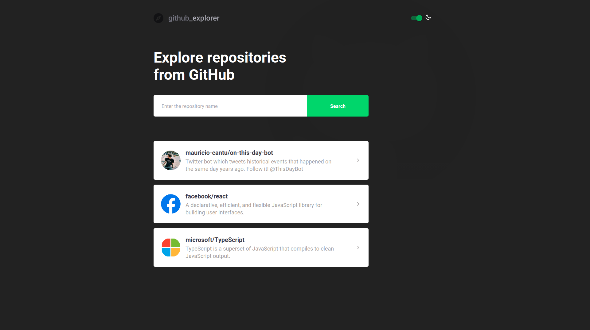

<h1 align="center">
    
</h1>

  <a href="#question-about">About</a>&nbsp;&nbsp;&nbsp;|&nbsp;&nbsp;&nbsp;
  <a href="#rocket-techs">Techs</a>&nbsp;&nbsp;&nbsp;|&nbsp;&nbsp;&nbsp;
  <a href="#heavy_plus_sign-extra-features">Extra features</a>&nbsp;&nbsp;&nbsp;|&nbsp;&nbsp;&nbsp;
  <a href="#wrench-setting-up-and-running-the-app">Running the app</a>&nbsp;&nbsp;&nbsp;|&nbsp;&nbsp;&nbsp;    
  <a href="#memo-license">License</a>

 

  

## :question: About

Search for a GitHub repository and get details about it, like owner, stars and its issues list.

## :rocket: Techs

This project was developed with the following technologies:

- [ReactJS](https://reactjs.org)
- [TypeScript](https://www.typescriptlang.org/)
- [Styled Components](https://styled-components.com/)
- [Framer Motion](https://www.framer.com/)

The following tools were used to maintain code formatting and style:

- [ESLint](https://eslint.org/)
- [Prettier](https://prettier.io/)
- [EditorConfig](https://editorconfig.org/)

## :heavy_plus_sign: Extra features

- Dark/Light theme switch
- Component animations with Framer Motion

## :wrench: Setting up and running the app

- `yarn` to install the dependencies
- `yarn start` to start the app

## :memo: License

This project is under MIT license. Read [LICENSE](LICENSE.md) file for more details.

---

Developed with ♥ by Maurício Cantú. 2020.
